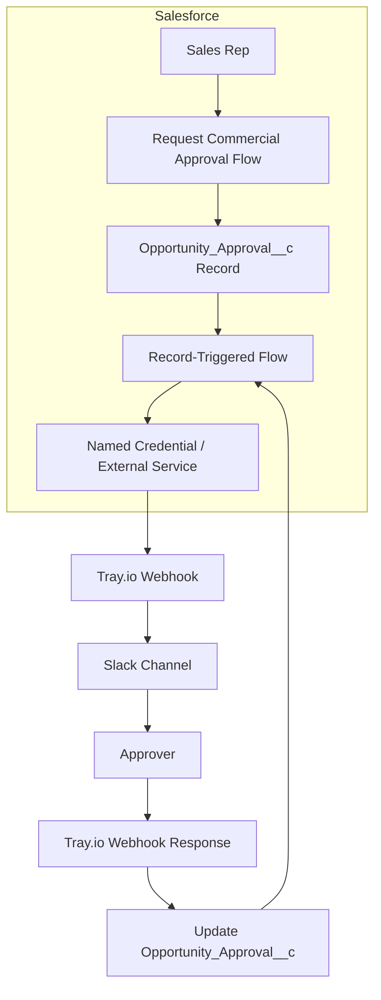
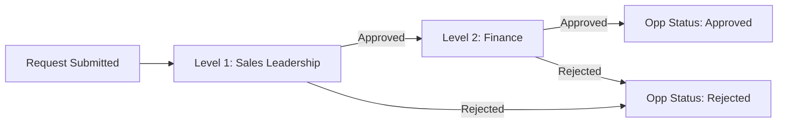
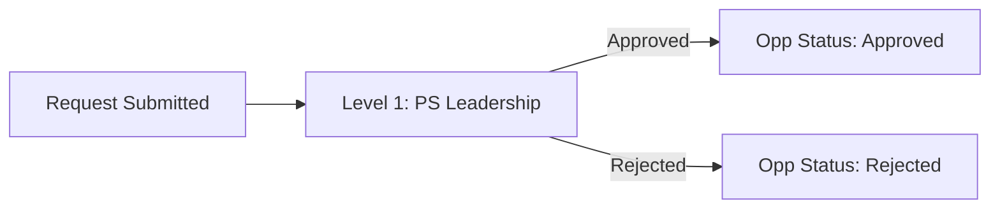

# Architecture Overview

A Salesforce-based approval system for commercial segment opportunities that require special review before closing. Integrates with Slack via Tray.io for real-time approval notifications and actions.

## System Context



## Approval Process Types

The system supports two distinct approval processes based on account characteristics:

### 1. Small Deal Approval
**Trigger:** Account has fewer than 10 physicians (`Total_Physician_Count_F__c < 10`)



- **Level 1 Approver:** Sales Leadership
- **Level 2 Approver:** Finance
- Both levels must approve for final approval

### 2. Standard PS Model Approval
**Trigger:** Account Segment = "Commercial" AND PS Model = "Standard"



- **Level 1 Approver:** PS Leadership
- Single-level approval
- Requires reason selection (H2H or Connection)

## Component Overview

### Salesforce Flows

| Flow | Type | Purpose |
|------|------|---------|
| `Request_Commercial_Approval` | Screen Flow | UI for sales reps to initiate approval requests |
| `Opportunity_Approval_AfterSave_Handle_Decision` | Record-Triggered | Routes decisions, creates next-level approvals, updates Opportunity |
| `Subflow_Send_Approval_Slack_Notification` | Autolaunched Subflow | Calls Tray.io webhook for Slack notifications |
| `Commercial_Approvals` | Approval Workflow | Standard Salesforce approval workflow (scaffold) |

### Custom Objects

| Object | Purpose |
|--------|---------|
| `Opportunity_Approval__c` | Tracks individual approval requests with full audit trail |

### External Integrations

| Component | Purpose |
|-----------|---------|
| `Tray_ai_Commercial_Approvals` (Named Credential) | Authenticates calls to Tray.io webhook |
| Tray.io Workflow | Receives approval requests, sends Slack messages, handles responses |
| Slack | Approver notification channel with interactive buttons |

## Data Flow

### Request Submission
1. Sales rep clicks action button on Opportunity
2. `Request_Commercial_Approval` flow launches
3. Flow checks Account criteria (physician count, segment, PS model)
4. Flow creates `Opportunity_Approval__c` record
5. Flow sets `Opportunity.Approval_Status__c` = "Pending"
6. Subflow calls Tray.io webhook with approval details

### Approval Decision
1. Approver clicks Approve/Reject in Slack
2. Tray.io webhook updates `Opportunity_Approval__c.Status__c`
3. `Opportunity_Approval_AfterSave_Handle_Decision` flow fires
4. Flow routes based on process type and level:
   - **Small Deal L1 Approved:** Creates Level 2 approval, notifies Finance
   - **Small Deal L2 Approved:** Sets Opportunity to Approved
   - **Standard PS Approved:** Sets Opportunity to Approved
   - **Any Rejection:** Sets Opportunity to Rejected

## Key Design Decisions

### Decision 1: Custom Object vs Native Approvals
- **Context:** Salesforce has native approval processes, but they lack flexibility for Slack integration
- **Decision:** Custom `Opportunity_Approval__c` object for tracking
- **Consequences:** More control over UI/UX, easier Slack integration, requires custom maintenance

### Decision 2: Tray.io as Integration Layer
- **Context:** Need bidirectional Slack communication (send messages, receive button clicks)
- **Decision:** Use Tray.io webhooks for both directions
- **Consequences:** No-code webhook management, but adds external dependency

### Decision 3: Flow-Based Architecture
- **Context:** Need maintainable automation without Apex code
- **Decision:** All logic implemented in declarative Flows
- **Consequences:** Easier for admins to maintain, some limitations vs code

## Technology Stack

| Layer | Technology | Purpose |
|-------|------------|---------|
| Platform | Salesforce (API 65.0) | CRM and automation platform |
| Automation | Salesforce Flows | Business logic and routing |
| Integration | Named Credentials | Secure external API authentication |
| Middleware | Tray.io | Webhook processing and Slack integration |
| Notification | Slack | Approver interface |

## Directory Structure

```
force-app/main/default/
├── flows/
│   ├── Request_Commercial_Approval.flow-meta.xml
│   ├── Opportunity_Approval_AfterSave_Handle_Decision.flow-meta.xml
│   ├── Subflow_Send_Approval_Slack_Notification.flow-meta.xml
│   └── Commercial_Approvals.flow-meta.xml
├── objects/
│   ├── Opportunity/
│   │   └── fields/
│   │       ├── Approval_Status__c.field-meta.xml
│   │       └── Approval_Request_Reason__c.field-meta.xml
│   └── Opportunity_Approval__c/
│       ├── Opportunity_Approval__c.object-meta.xml
│       └── fields/
│           ├── Status__c.field-meta.xml
│           ├── Process_Type__c.field-meta.xml
│           ├── Level__c.field-meta.xml
│           ├── Approver_Role__c.field-meta.xml
│           └── ...
├── namedCredentials/
│   └── Tray_ai_Commercial_Approvals.namedCredential-meta.xml
└── externalCredentials/
    └── Tray_ai_Commercial_Approvals.externalCredential-meta.xml
```

## Related Documentation

- [Data Models](data-models.md) - Object and field definitions
- [Configuration](configuration.md) - Named credentials and setup
- [Development Guide](development.md) - Local setup and deployment
