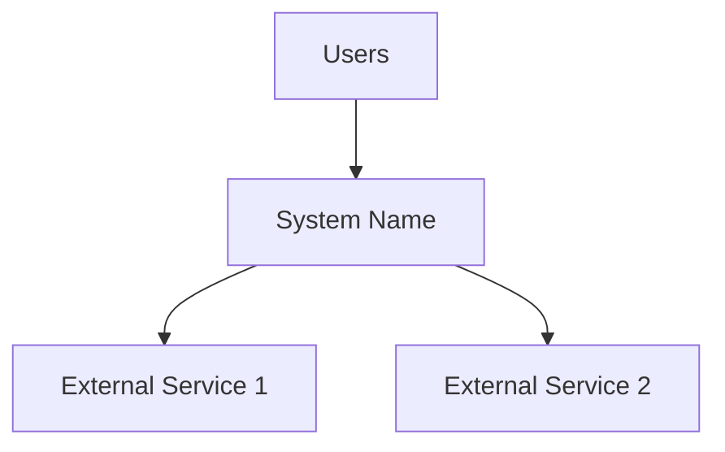
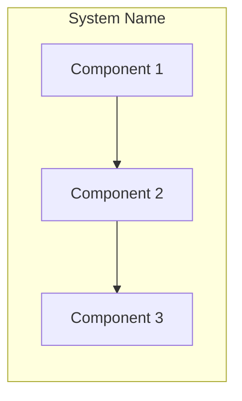

# Architecture Overview

> Brief 1-2 sentence description of what this system does.

## System Context



Describe how this system fits into the larger ecosystem. What does it depend on? What depends on it?

## High-Level Architecture



### Component 1: Name
- **Purpose**: What this component does
- **Location**: `src/component1/`
- **Key files**: `main.ts`, `handler.ts`

### Component 2: Name
- **Purpose**: What this component does
- **Location**: `src/component2/`
- **Key files**: List key files

### Component 3: Name
- **Purpose**: What this component does
- **Location**: `src/component3/`
- **Key files**: List key files

## Data Flow

Describe how data moves through the system for the primary use case.

1. **Input**: Where data enters
2. **Processing**: What transformations occur
3. **Output**: Where results go

## Key Design Decisions

### Decision 1: [Title]
- **Context**: Why this decision was needed
- **Decision**: What was chosen
- **Consequences**: Trade-offs and implications

### Decision 2: [Title]
- **Context**: Why this decision was needed
- **Decision**: What was chosen
- **Consequences**: Trade-offs and implications

## Technology Stack

| Layer | Technology | Purpose |
|-------|------------|---------|
| Runtime | Node.js / Python / etc. | Language runtime |
| Framework | Express / FastAPI / etc. | Web framework |
| Database | PostgreSQL / MongoDB / etc. | Data persistence |
| Cache | Redis / etc. | Caching layer |

## Directory Structure

```
project/
├── src/           # Source code
│   ├── api/       # API routes
│   ├── services/  # Business logic
│   └── models/    # Data models
├── tests/         # Test files
├── config/        # Configuration
└── docs/          # Documentation
```

## Related Documentation

- [API Reference](api-reference.md)
- [Data Models](data-models.md)
- [Configuration](configuration.md)
