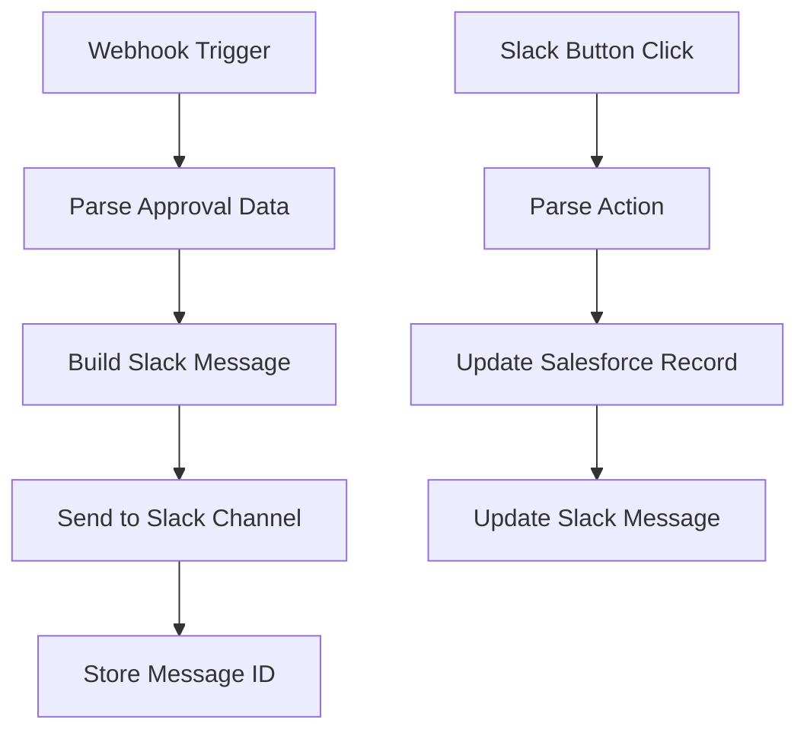

# Configuration

## Overview

The Commercial Approval system requires configuration in both Salesforce (Named Credentials) and Tray.io (webhook workflows).

## Named Credentials

### Tray_ai_Commercial_Approvals

Authenticates outbound calls from Salesforce Flows to the Tray.io webhook.

**Location:** Setup → Security → Named Credentials

| Property | Value |
|----------|-------|
| Label | Tray.ai Commercial Approvals |
| Name | `Tray_ai_Commercial_Approvals` |
| URL | `https://{your-tray-webhook-url}.trayapp.io` |
| Authentication | External Credential |
| Generate Auth Header | No |
| Allow Merge Fields in Body | No |
| Allow Merge Fields in Header | Yes |

### External Credential

**Location:** Setup → Security → External Credentials

| Property | Value |
|----------|-------|
| Label | Tray.ai Commercial Approvals |
| Name | `Tray_ai_Commercial_Approvals` |
| Authentication Protocol | Custom (or as configured in Tray) |

**Note:** The external credential should match the authentication mechanism configured in your Tray.io webhook trigger (API key, OAuth, etc.).

---

## Tray.io Workflow Configuration

The Tray.io workflow handles bidirectional communication with Slack.

### Required Workflow Components



### Webhook Trigger Input Schema

The Salesforce flow sends this payload:

```json
{
  "approval_record_id": "a0X...",
  "opportunity_id": "006...",
  "process_type": "Small Deal",
  "level": 1,
  "account_name": "Example Health System",
  "opportunity_name": "Example Opp",
  "physician_count": 8,
  "owner_name": "John Doe",
  "request_reason": null
}
```

### Webhook Response (Button Click)

When an approver clicks Approve/Reject in Slack, Tray should update Salesforce:

**PATCH** to Salesforce REST API:
```
/services/data/v65.0/sobjects/Opportunity_Approval__c/{approval_record_id}
```

**Body:**
```json
{
  "Status__c": "Approved",
  "Approver__c": "{slack_user_sfdc_id}",
  "Decision_Date__c": "{iso_datetime}",
  "Notes__c": "{optional_comments}"
}
```

---

## Slack Configuration

### Channel Setup

Decide where approval requests should be posted:

| Process Type | Recommended Channel |
|--------------|---------------------|
| Small Deal (Level 1) | `#sales-leadership-approvals` |
| Small Deal (Level 2) | `#finance-approvals` |
| Standard PS Model | `#ps-leadership-approvals` |

### Slack App Permissions

The Slack app used by Tray.io needs:
- `chat:write` - Post messages
- `chat:write.public` - Post to public channels
- `users:read` - Look up user info

### Message Format

Recommended Slack Block Kit structure:

```json
{
  "blocks": [
    {
      "type": "header",
      "text": {"type": "plain_text", "text": "🔔 Approval Request: Small Deal"}
    },
    {
      "type": "section",
      "fields": [
        {"type": "mrkdwn", "text": "*Account:*\nExample Health System"},
        {"type": "mrkdwn", "text": "*Physician Count:*\n8"},
        {"type": "mrkdwn", "text": "*Opportunity:*\nExample Opp"},
        {"type": "mrkdwn", "text": "*Requested By:*\nJohn Doe"}
      ]
    },
    {
      "type": "actions",
      "elements": [
        {"type": "button", "text": {"type": "plain_text", "text": "✅ Approve"}, "style": "primary", "action_id": "approve"},
        {"type": "button", "text": {"type": "plain_text", "text": "❌ Reject"}, "style": "danger", "action_id": "reject"},
        {"type": "button", "text": {"type": "plain_text", "text": "View in Salesforce"}, "url": "https://..."}
      ]
    }
  ]
}
```

---

## Flow Configuration

### Request_Commercial_Approval Flow

| Setting | Value |
|---------|-------|
| Status | Draft (set to Active when ready) |
| Run Mode | Default Mode (runs as current user) |
| Available From | Record Page action button |

**To activate:**
1. Open Flow in Setup → Flows
2. Click Activate
3. Add to Opportunity Lightning Record Page as Action Button

### Opportunity_Approval_AfterSave_Handle_Decision Flow

| Setting | Value |
|---------|-------|
| Status | Draft (set to Active when ready) |
| Trigger | Record-Triggered (After Save) |
| Object | Opportunity_Approval__c |
| Condition | `Status__c` Is Changed = True |

**To activate:**
1. Open Flow in Setup → Flows
2. Verify trigger conditions
3. Click Activate

### Subflow_Send_Approval_Slack_Notification

| Setting | Value |
|---------|-------|
| Status | Draft |

**TODO:** This subflow needs the External Service action configured to call the Tray.io webhook. Currently it only has input variables defined.

---

## Environment-Specific Configuration

### Development/Sandbox

| Setting | Value |
|---------|-------|
| Named Credential URL | Tray.io dev/test webhook URL |
| Slack Channel | `#approvals-test` |
| Flow Status | Active for testing |

### Production

| Setting | Value |
|---------|-------|
| Named Credential URL | Tray.io production webhook URL |
| Slack Channels | Production approval channels |
| Flow Status | Active |

---

## Checklist: Pre-Deployment

- [ ] Named Credential created with correct Tray.io URL
- [ ] External Credential configured with authentication
- [ ] Tray.io workflow published and tested
- [ ] Slack app installed with correct permissions
- [ ] Slack channels created
- [ ] Subflow has External Service action configured
- [ ] All flows activated
- [ ] Permission sets assigned to users
- [ ] Action button added to Opportunity page layout

---

## Troubleshooting

### "Unable to find Named Credential"

Ensure the Named Credential API name exactly matches what's referenced in the Flow External Service action.

### "401 Unauthorized" from Tray.io

Check External Credential authentication settings match Tray.io webhook authentication.

### Slack messages not appearing

1. Verify Tray.io workflow is published
2. Check Slack app has correct channel permissions
3. Review Tray.io workflow execution logs

### Approval status not updating

1. Verify `Opportunity_Approval_AfterSave_Handle_Decision` flow is active
2. Check flow trigger conditions
3. Review Salesforce debug logs for flow errors
