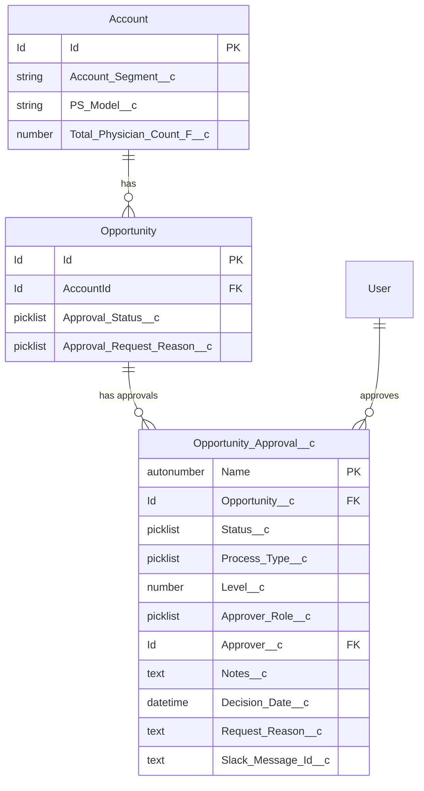
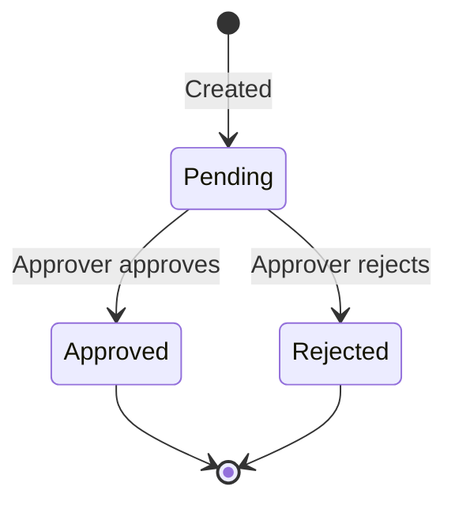
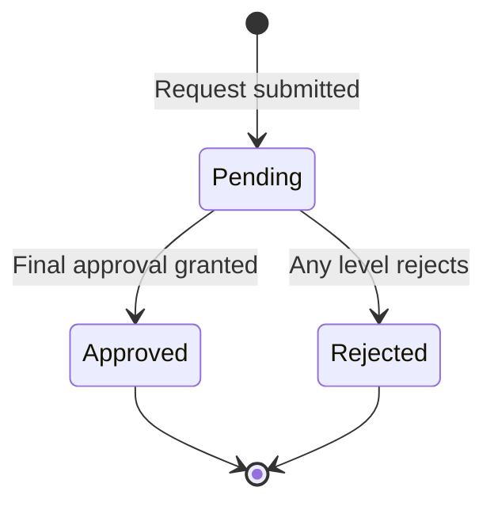

# Data Models

## Overview

The approval system extends the standard Opportunity object and introduces a custom `Opportunity_Approval__c` object to track individual approval requests.

## Entity Relationship Diagram



---

## Opportunity_Approval__c (Custom Object)

Tracks individual approval requests and decisions. Supports tiered approvals with full audit trail.

### Object Definition

| Property | Value |
|----------|-------|
| API Name | `Opportunity_Approval__c` |
| Label | Opportunity Approval |
| Plural Label | Opportunity Approvals |
| Name Field | Auto-number (`OA-{0000}`) |
| Sharing Model | ControlledByParent |
| History Tracking | Enabled |
| Reports | Enabled |
| Search | Enabled |

### Fields

| Field | API Name | Type | Required | Description |
|-------|----------|------|----------|-------------|
| Approval Number | `Name` | Auto-number | Yes | Auto-generated ID (OA-0001, etc.) |
| Opportunity | `Opportunity__c` | Master-Detail | Yes | Parent opportunity |
| Status | `Status__c` | Picklist | Yes | Current status (Pending, Approved, Rejected) |
| Process Type | `Process_Type__c` | Picklist | Yes | Which approval process (Small Deal, Standard PS Model) |
| Level | `Level__c` | Number | Yes | Approval tier (1 or 2) |
| Approver Role | `Approver_Role__c` | Picklist | No | Expected approver group |
| Approver | `Approver__c` | Lookup(User) | No | User who made the decision |
| Notes | `Notes__c` | Long Text | No | Approver comments |
| Decision Date | `Decision_Date__c` | DateTime | No | When decision was made |
| Request Reason | `Request_Reason__c` | Text | No | Why approval was requested (for Standard PS) |
| Slack Message Id | `Slack_Message_Id__c` | Text | No | For updating Slack message after decision |

### Status Picklist Values

| Value | Description |
|-------|-------------|
| `Pending` | Awaiting approver decision (default) |
| `Approved` | Approver approved the request |
| `Rejected` | Approver rejected the request |

### Process Type Picklist Values

| Value | Description |
|-------|-------------|
| `Small Deal` | Account has <10 physicians |
| `Standard PS Model` | Commercial segment with Standard PS |

### Approver Role Picklist Values

| Value | Used For |
|-------|----------|
| `Sales Leadership` | Small Deal Level 1 |
| `Finance` | Small Deal Level 2 |
| `PS Leadership` | Standard PS Model |

---

## Opportunity Fields (Extended)

Fields added to the standard Opportunity object for approval tracking.

### Approval_Status__c

| Property | Value |
|----------|-------|
| Type | Picklist |
| Required | No |
| Tracked | No |

**Values:**
| Value | Description |
|-------|-------------|
| `Pending` | Approval request submitted, awaiting decision |
| `Approved` | All required approvals received |
| `Rejected` | At least one approver rejected |

### Approval_Request_Reason__c

| Property | Value |
|----------|-------|
| Type | Picklist |
| Required | No |
| Tracked | No |

**Values:**
| Value | Description |
|-------|-------------|
| `H2H` | Head-to-head competitive situation |
| `Connection` | Strategic connection/relationship |

---

## Account Fields (Referenced)

These existing Account fields drive approval routing:

| Field | API Name | Type | Used For |
|-------|----------|------|----------|
| Account Segment | `Account_Segment__c` | Picklist | Determine if Standard PS approval needed |
| PS Model | `PS_Model__c` | Picklist | Determine if Standard PS approval needed |
| Total Physician Count | `Total_Physician_Count_F__c` | Number (Formula) | Determine if Small Deal approval needed |

---

## State Transitions

### Opportunity_Approval__c.Status__c



### Opportunity.Approval_Status__c



---

## Indexes and Performance

The `Opportunity_Approval__c` object uses:
- Master-Detail relationship for automatic record sharing
- History tracking for audit compliance
- Auto-number naming for unique identification

**Query Considerations:**
- Filter by `Opportunity__c` for all approvals on an opportunity
- Filter by `Status__c = 'Pending'` for active approvals
- Use `Process_Type__c` and `Level__c` together to identify specific approval steps

---

## Example SOQL Queries

**Get all pending approvals for an opportunity:**
```sql
SELECT Id, Name, Process_Type__c, Level__c, Approver_Role__c, Status__c, CreatedDate
FROM Opportunity_Approval__c
WHERE Opportunity__c = :opportunityId
AND Status__c = 'Pending'
ORDER BY Level__c ASC
```

**Get approval history for an opportunity:**
```sql
SELECT Id, Name, Process_Type__c, Level__c, Status__c, Approver__r.Name, Decision_Date__c, Notes__c
FROM Opportunity_Approval__c
WHERE Opportunity__c = :opportunityId
ORDER BY CreatedDate ASC
```

**Find opportunities pending approval:**
```sql
SELECT Id, Name, Account.Name, Approval_Status__c
FROM Opportunity
WHERE Approval_Status__c = 'Pending'
```
