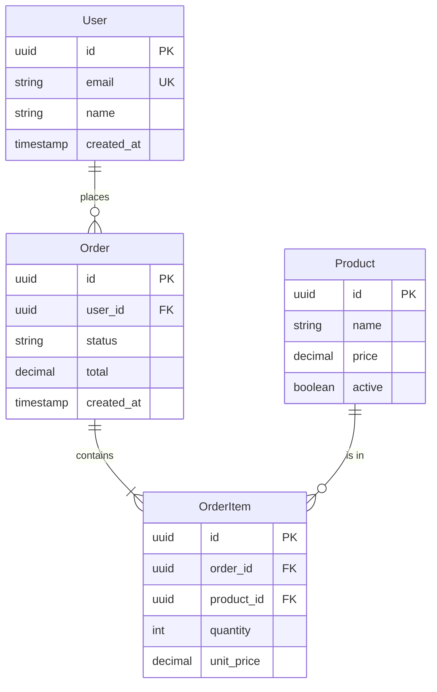
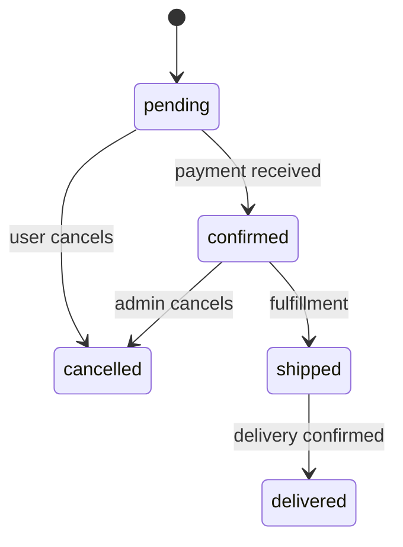

# Data Models

## Overview

Describe the data layer: what database(s), ORM if any, key design patterns.

## Entity Relationship Diagram



---

## Models

### User

Represents a system user.

**Schema**

| Field | Type | Constraints | Description |
|-------|------|-------------|-------------|
| `id` | UUID | PK | Unique identifier |
| `email` | string(255) | UNIQUE, NOT NULL | User's email address |
| `name` | string(100) | NOT NULL | Display name |
| `password_hash` | string(255) | NOT NULL | Bcrypt hash |
| `role` | enum | NOT NULL, DEFAULT 'user' | user, admin |
| `created_at` | timestamp | NOT NULL | Creation time |
| `updated_at` | timestamp | NOT NULL | Last update time |

**Indexes**

- `users_email_idx` on `email` (unique)
- `users_created_at_idx` on `created_at`

**Relationships**

- Has many `Orders`
- Has many `Sessions`

**Type Definition**

```typescript
interface User {
  id: string;
  email: string;
  name: string;
  role: 'user' | 'admin';
  createdAt: Date;
  updatedAt: Date;
}
```

---

### Order

Represents a customer order.

**Schema**

| Field | Type | Constraints | Description |
|-------|------|-------------|-------------|
| `id` | UUID | PK | Unique identifier |
| `user_id` | UUID | FK → users.id, NOT NULL | Owning user |
| `status` | enum | NOT NULL | pending, confirmed, shipped, delivered, cancelled |
| `total` | decimal(10,2) | NOT NULL | Order total |
| `shipping_address` | jsonb | | Shipping address object |
| `created_at` | timestamp | NOT NULL | Creation time |
| `updated_at` | timestamp | NOT NULL | Last update time |

**Indexes**

- `orders_user_id_idx` on `user_id`
- `orders_status_idx` on `status`
- `orders_created_at_idx` on `created_at`

**Relationships**

- Belongs to `User`
- Has many `OrderItems`

**Status Transitions**



---

### Product

Represents a purchasable product.

**Schema**

| Field | Type | Constraints | Description |
|-------|------|-------------|-------------|
| `id` | UUID | PK | Unique identifier |
| `sku` | string(50) | UNIQUE, NOT NULL | Stock keeping unit |
| `name` | string(200) | NOT NULL | Product name |
| `description` | text | | Full description |
| `price` | decimal(10,2) | NOT NULL | Current price |
| `active` | boolean | NOT NULL, DEFAULT true | Is purchasable |
| `metadata` | jsonb | | Additional attributes |
| `created_at` | timestamp | NOT NULL | Creation time |

---

## Enums

### OrderStatus

```sql
CREATE TYPE order_status AS ENUM (
  'pending',
  'confirmed',
  'shipped',
  'delivered',
  'cancelled'
);
```

### UserRole

```sql
CREATE TYPE user_role AS ENUM (
  'user',
  'admin'
);
```

---

## JSON Structures

### ShippingAddress

Stored in `orders.shipping_address`:

```json
{
  "name": "John Doe",
  "line1": "123 Main St",
  "line2": "Apt 4B",
  "city": "New York",
  "state": "NY",
  "postal_code": "10001",
  "country": "US"
}
```

---

## Migrations

Migrations are located in `db/migrations/` and follow the naming convention:

```
YYYYMMDDHHMMSS_description.sql
```

### Running Migrations

```bash
# Apply all pending migrations
npm run db:migrate

# Rollback last migration
npm run db:rollback

# Check migration status
npm run db:status
```

---

## Data Validation

Validation rules enforced at the application layer:

### User

- `email`: Valid email format, max 255 chars
- `name`: 1-100 characters
- `password`: Min 8 chars, requires uppercase, lowercase, number

### Order

- `total`: Must equal sum of order items
- `status`: Valid enum value
- Cannot transition to invalid status

---

## Soft Deletes

The following models use soft deletes (`deleted_at` timestamp):

- User
- Product

Soft-deleted records are excluded from queries by default.
